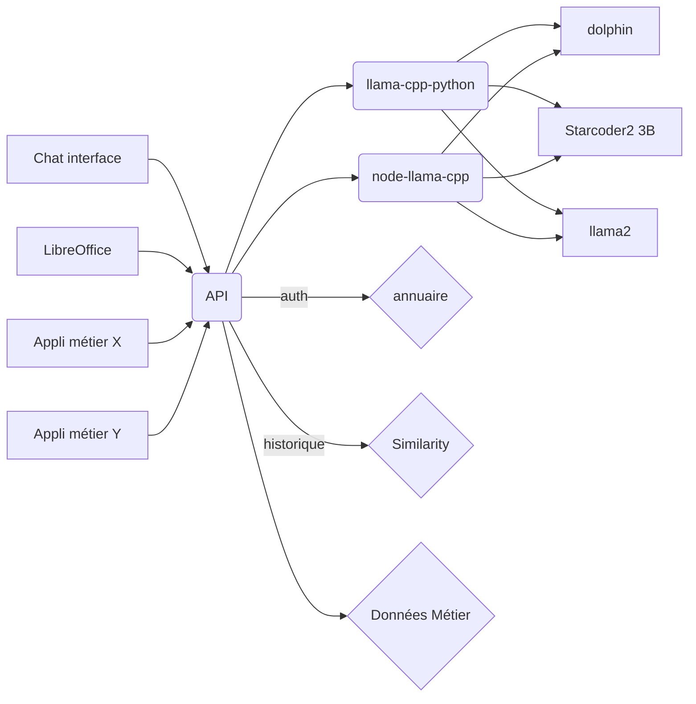

# Igora-reloaded



# backend
## installation du backend (la première fois seulement)
- télécharger https://huggingface.co/TheBloke/dolphin-2.2.1-mistral-7B-GGUF/resolve/main/dolphin-2.2.1-mistral-7b.Q2_K.gguf?download=true et le placer dans le dossier models

```bash
cd backEndTest
python -m venv .venv
source .venv/bin/activate
pip install llama-cpp-python[server] --extra-index-url https://abetlen.github.io/llama-cpp-python/whl/cpu
```

## lancer le backend
```bash
source .venv/bin/activate # si l'environnement n'est pas totalement configure
cd backEndTest # si on n'est pas déjà dans le dossier backEndTest
#python3 -m llama_cpp.server --model ./models/dolphin-2.2.1-mistral-7b.Q2_K.gguf 
#ou si le port est déjà utilisé python3 -m llama_cpp.server --model ./models/dolphin-2.2.1-mistral-7b.Q2_K.gguf --port 5677 --host 0.0.0.0
# ou 
python3 -m llama_cpp.server --model ./models/llama-pro-8b-instruct.Q2_K.gguf --port 5678
# ou lancer igora
```


# lancer l'API

```bash
cd reloaded
npm run dev
```


# openai compatibilité
- https://platform.openai.com/docs/api-reference/chat/create
- stream https://cookbook.openai.com/examples/how_to_stream_completions


# Implementation des tests
- https://buddy.works/guides/how-automate-nodejs-unit-tests-with-mocha-chai
- https://petals.dev


