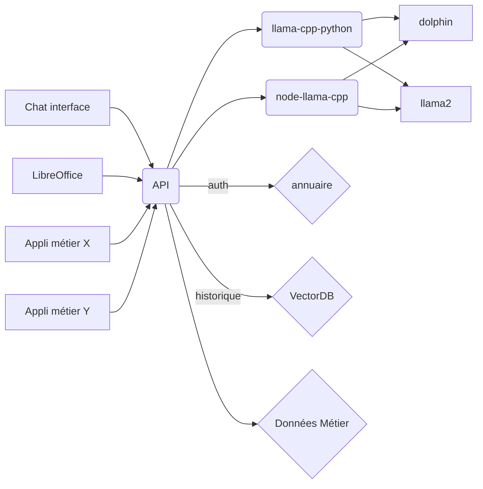

#

```mermaid

graph LR
    A[Chat interface] --> B(API)
    B --> C(llama-cpp-python)
    C --> D[dolphin]
    C --> E[llama2]
    F[LibreOffice] --> B
    G[Appli métier X] --> B
    H[Appli métier Y] --> B
    B --> I(node-llama-cpp)
    I --> D
    I --> E
    
    B --auth--> J{annuaire}
    B --historique --> K{VectorDB}
    B --> L{Données Métier}

```